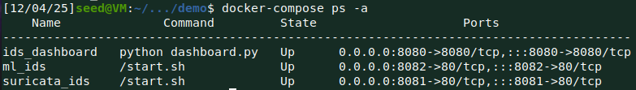

# 50.020 Network Security Project

## Instructions for Project
Find cybersecurity research paper that discusses a “network” security solution using AI, implement, and demonstrate.

## Paper Selected
- [A comparative analysis of Network Intrusion Detection (NID) using ArtificialIntelligence techniques for increase network security](https://ijsra.net/sites/default/files/IJSRA-2024-2664.pdf)
    - [Offline pdf paper here](docs/IJSRA-2024-2664.pdf)


## Demonstration Diagram

```
┌─────────────────────────────────────────────────────────┐
│                    Host Machine                         │
│  ┌────────────────┐                                     │
│  │ Attack Scripts │                                     │
│  │  - Basic SQLi  │                                     │
│  │  - Obfuscated  │                                     │
│  └────────────────┘                                     │
│         │                                               |
│         └───────────┬──────────────┐                    │
│                     ▼              ▼                    │
│  ┌─────────────────────────┐  ┌──────────────────────┐  │
│  │ Container 1: Suricata   │  │ Container 2: ML-IDS  │  │
│  │ ┌─────────────────────┐ │  │ ┌──────────────────┐ │  │
│  │ │       DVWA          │ │  │ │      DVWA        │ │  │
│  │ │    (php/mySQL)      │ │  │ │  (php/mySQL)     │ │  │
│  │ └─────────────────────┘ │  │ └──────────────────┘ │  │
│  │ ┌─────────────────────┐ │  │ ┌──────────────────┐ │  │
│  │ │  Suricata IDS       │ │  │ │ ML-IDS Engine    │ │  │
│  │ │  (Signature-based)  │ │  │ │ (XGBoost)        │ │  │
│  │ └─────────────────────┘ │  │ └──────────────────┘ │  │
│  │   Port: 8081            │  │    Port: 8082        │  │
│  └─────────────────────────┘  └──────────────────────┘  │
|         |                                   |           |
│         └────────────────────┬──────────────┘           |       
│                              ▼                          |
│                    ┌──────────────────┐                 │
│                    │   Dashboard      │                 │
│                    │   (Port 8080)    │                 │
│                    └──────────────────┘                 |
|                                                         |      
└─────────────────────────────────────────────────────────┘
```

### Demonstration methodology
1. Rules to detect simple SQL injection attacks using Suricata IDS.
2. Hopefully, suricata IDS will be able to detect basic SQL injection attacks based on the rules defined since the signatures are well known and can be matched easily.
3. Then we run an obfuscated SQL injection attack that uses techniques such as encoding, comments, and whitespace variations to evade detection.
4. Suricata IDS is expected to miss the obfuscated SQL injection attacks since the signatures are altered and do not match the predefined rules.
5. The ML-based IDS (XGBoost model) is expected to detect both basic and obfuscated SQL injection attacks since it learns patterns and behaviors associated with SQL injection attacks, rather than relying solely on predefined signatures.
6. Finally, we compare the detection rates and false positives between Suricata IDS and the ML-based IDS to evaluate their effectiveness in detecting SQL injection attacks.

## Training and Testing Results from models
### Random Forest - top_k_features=20:
- ```
    Accuracy:  0.9979550142811806
    Precision: 0.9091980162329223
    Recall:    0.8776742197272457
    F1 Score:  0.8803905796034613
    ```

### Random Forest - top_k_features=30:
- ```
    Accuracy:  0.9979907172326246
    Precision: 0.8943574123921240
    Recall:    0.8732284279514898
    F1 Score:  0.8701581930169169
    ```
### XGBoost - top_k_features=20:
- ```
    Accuracy:  0.9978717073944780
    Precision: 0.8632622623490404
    Recall:    0.8921039437487060
    F1 Score:  0.8677380657296273
    ```
### XGBoost - top_k_feature=30:
- ```
    Accuracy:  0.9979490637892733
    Precision: 0.8794418469289690
    Recall:    0.9044405844037275
    F1 Score:  0.8860424996997219
    ```

## Setup Instructions for Demonstration Environment
### Prerequisites
1. Docker installed on you machine, along with Docker Compose.
2. We tested this setup on a x86_64 ubuntu 20.04 virtual box VM.
    - We used the ubuntu 20.04 image provided by SEED-Labs for simplicity.
    - Ensure that you do a `sudo apt update && sudo apt upgrade -y` after setting up the VM to get the latest packages.

### Setting up Docker Containers
1. Follow the instructions as follows:
    - ```
        # Clone the repository
        git clone https://github.com/sngamos/50.020-Network-Security-Project.git

        # Change directory to the project folder
        cd 50.020-Network-Security-Project/demo

        # Stop all containers
        docker-compose down

        # Remove any orphaned containers
        docker-compose down --remove-orphans

        # Rebuild all containers (forces rebuild even if no changes detected)
        docker-compose build --no-cache

        # Start all containers in detached mode
        docker-compose up -d

        # Follow logs to see startup progress
        docker-compose logs -f

        # Check status of containers
        docker-compose ps -a
        ```
2. If everything was setup correctly you should see this something similar to this output:
    - ```
        Name              Command         State                    Ports                  
        --------------------------------------------------------------------------------------
        ids_dashboard   python dashboard.py   Up      0.0.0.0:8080->8080/tcp,:::8080->8080/tcp
        ml_ids          /start.sh             Up      0.0.0.0:8082->80/tcp,:::8082->80/tcp    
        suricata_ids    /start.sh             Up      0.0.0.0:8081->80/tcp,:::8081->80/tcp    
        ```
    - 
    - The ids dashboard is running on port 8080, Suricata IDS on port 8081 and ML-IDS on port 8082.

### Accessing the Dashboard
1. Open a web browser and navigate to `http://localhost:8080`.
2. You should see the dashboard:
    - 