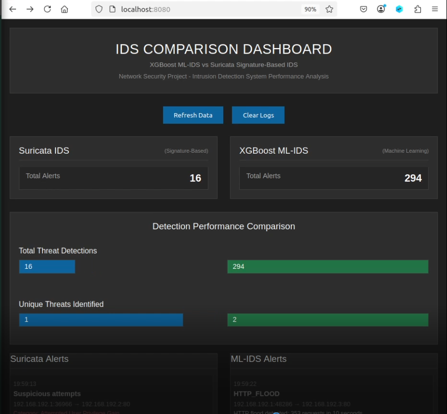

# 50.020 Network Security Project

## Paper Selected
- [A comparative analysis of Network Intrusion Detection (NID) using ArtificialIntelligence techniques for increase network security](https://ijsra.net/sites/default/files/IJSRA-2024-2664.pdf)
- [Offline pdf paper here](docs/IJSRA-2024-2664.pdf)

## Demonstration Diagram
```
┌─────────────────────────────────────────────────────────────────────┐
│                          Host Machine                               │
│  ┌──────────────────────────────────────────────────────────────┐   │
│  │ Comprehensive Attack Suite (attack_suite.py)                 │   │
│  │                                                              │   │
│  │ Malicious Tests (8):                                         │   │
│  │  • Basic SQL Injection         • Command Injection           │   │
│  │  • Obfuscated SQL Injection    • Port Scan                   │   │
│  │  • Cross-Site Scripting (XSS)  • Brute Force                 │   │
│  │  • File Inclusion              • Slowloris DoS               │   │
│  │  • HTTP Flood                                                │   │
│  │                                                              │   │
│  │ Benign Tests (5):                                            │   │
│  │  • Normal Browsing    • Legitimate Login                     │   │
│  │  • Search Queries     • File Access                          │   │
│  │  • API Calls                                                 │   │
│  │                                                              │   │
│  │ Usage: python3 attack_suite.py localhost:8081 localhost:8082 │   │
│  └──────────────────────────────────────────────────────────────┘   │
│         │                                                           │
│         └────────────────┬───────────────────┐                      │
│                          ▼                   ▼                      │
│  ┌─────────────────────────────┐  ┌──────────────────────────┐      │
│  │ Container 1: Suricata IDS   │  │ Container 2: ML-IDS      │      │
│  │ ┌─────────────────────────┐ │  │ ┌──────────────────────┐ │      │
│  │ │       DVWA              │ │  │ │      DVWA            │ │      │
│  │ │    (PHP/MySQL)          │ │  │ │  (PHP/MySQL)         │ │      │
│  │ └─────────────────────────┘ │  │ └──────────────────────┘ │      │
│  │ ┌─────────────────────────┐ │  │ ┌──────────────────────┐ │      │
│  │ │  Suricata 8.0           │ │  │ │ ML-IDS Engine        │ │      │
│  │ │  • 6 Custom Rules       │ │  │ │ • XGBoost Model      │ │      │
│  │ │  • Signature Detection  │ │  │ │ • Pattern Detection  │ │      │
│  │ │  • eve.json Output      │ │  │ │ • JSON Alerts        │ │      │
│  │ └─────────────────────────┘ │  │ └──────────────────────┘ │      │
│  │   Port: 8081 (DVWA)         │  │    Port: 8082 (DVWA)     │      │
│  │   Logs: /shared/logs/       │  │    Logs: /shared/logs/   │      │
│  └─────────────────────────────┘  └──────────────────────────┘      │
│         │                                   │                       │
│         └────────────────────┬──────────────┘                       │       
│                              ▼                                      │
│                    ┌──────────────────────┐                         │
│                    │   Flask Dashboard    │                         │
│                    │   • Real-time View   │                         │
│                    │   • Dark Mode UI     │                         │
│                    │   • Comparison Bars  │                         │
│                    │   • Singapore Time   │                         │
│                    │   • Clear Logs API   │                         │
│                    │   Port: 8080         │                         │
│                    └──────────────────────┘                         │
│                                                                     │      
└─────────────────────────────────────────────────────────────────────┘
```

### Demonstration Methodology
**Dual-Target Testing Approach:**
1. The attack suite simultaneously targets both IDS systems (Suricata on port 8081 and ML-IDS on port 8082) running identical DVWA instances.
2. Each attack is executed against both systems in real-time, allowing for direct comparison of detection capabilities.

**Attack Categories:**

**A. Signature-Based Detection Tests**
- Basic SQL Injection (UNION SELECT patterns)
- Command Injection (shell metacharacters)
- Port Scanning (rapid SYN packets)
- Brute Force (rapid login attempts)
- XSS attacks (script tags and event handlers)
- File Inclusion (directory traversal patterns)

**B. Evasion Technique Tests**
- Obfuscated SQL Injection using URL encoding, comment insertion, whitespace manipulation, and case variation
- Slowloris DoS (slow HTTP connections)
- HTTP Flood (rapid legitimate-looking requests)

**C. Benign Traffic Baseline**
- Normal web browsing, legitimate logins, search queries, file access, and API calls
- Used to evaluate false positive rates

**Expected Outcomes:**
- Suricata excels at detecting known attack signatures with low false positives
- ML-IDS (XGBoost) demonstrates superior detection of obfuscated attacks and novel patterns
- Dashboard provides real-time visual comparison of both systems' performance
- Benign traffic tests validate low false positive rates for both systems

### Training and Testing Results from models
**Random Forest - top_k_features=20:**
- ```
    Accuracy:  0.9979550142811806
    Precision: 0.9091980162329223
    Recall:    0.8776742197272457
    F1 Score:  0.8803905796034613
    ```

**Random Forest - top_k_features=30:**
- ```
    Accuracy:  0.9979907172326246
    Precision: 0.8943574123921240
    Recall:    0.8732284279514898
    F1 Score:  0.8701581930169169
    ```
**XGBoost - top_k_features=20:**
- ```
    Accuracy:  0.9978717073944780
    Precision: 0.8632622623490404
    Recall:    0.8921039437487060
    F1 Score:  0.8677380657296273
    ```
**XGBoost - top_k_features=30:**
- ```
    Accuracy:  0.9979490637892733
    Precision: 0.8794418469289690
    Recall:    0.9044405844037275
    F1 Score:  0.8860424996997219
    ```

## Setup Instructions for Demonstration Environment
### Prerequisites
1. Docker installed on you machine, along with docker-compose.
2. We tested this setup on a x86_64 ubuntu 20.04 virtual box VM.
    - We used the ubuntu 20.04 image provided by SEED-Labs for simplicity.
    - Ensure that you do a `sudo apt update && sudo apt upgrade -y` after setting up the VM to get the latest packages.

### Setting up Docker Containers
1. Follow the instructions as follows:
    - ```
        # Clone the repository
        git clone https://github.com/sngamos/50.020-Network-Security-Project.git

        # Change directory to the project folder
        cd 50.020-Network-Security-Project/demo

        # Stop all containers
        docker-compose down

        # Remove any orphaned containers
        docker-compose down --remove-orphans

        # Rebuild all containers (forces rebuild even if no changes detected)
        docker-compose build --no-cache

        # Start all containers in detached mode
        docker-compose up -d

        # Follow logs to see startup progress
        docker-compose logs -f

        # Check status of containers
        docker-compose ps -a
        ```
2. If everything was setup correctly you should see this something similar to this output:
    - ```
        Name              Command         State                    Ports                  
        --------------------------------------------------------------------------------------
        ids_dashboard   python dashboard.py   Up      0.0.0.0:8080->8080/tcp,:::8080->8080/tcp
        ml_ids          /start.sh             Up      0.0.0.0:8082->80/tcp,:::8082->80/tcp    
        suricata_ids    /start.sh             Up      0.0.0.0:8081->80/tcp,:::8081->80/tcp    
        ```
    - 
    - The ids dashboard is running on port 8080, Suricata IDS on port 8081 and ML-IDS on port 8082.

### Accessing the Dashboard
1. Open a web browser and navigate to `http://localhost:8080`.
2. You should see the dashboard:
    - 

### Running the Attack Suite
1. Open a terminal and navigate to the `demo/attacks` directory.
2. Install the required Python packages:
    - ```
        pip install -r requirements.txt
        ```
3. Run the attack suite targeting both IDS systems:
    - ```
        python attack_suite.py localhost:8081 localhost:8082
        ```
4. The attack suite will execute a series of malicious and benign tests against both IDS systems and print the results to the console.
5. Monitor the dashboard in real-time to observe detection rates and alerts generated by each IDS system.
    - 
    - You should see something like this
